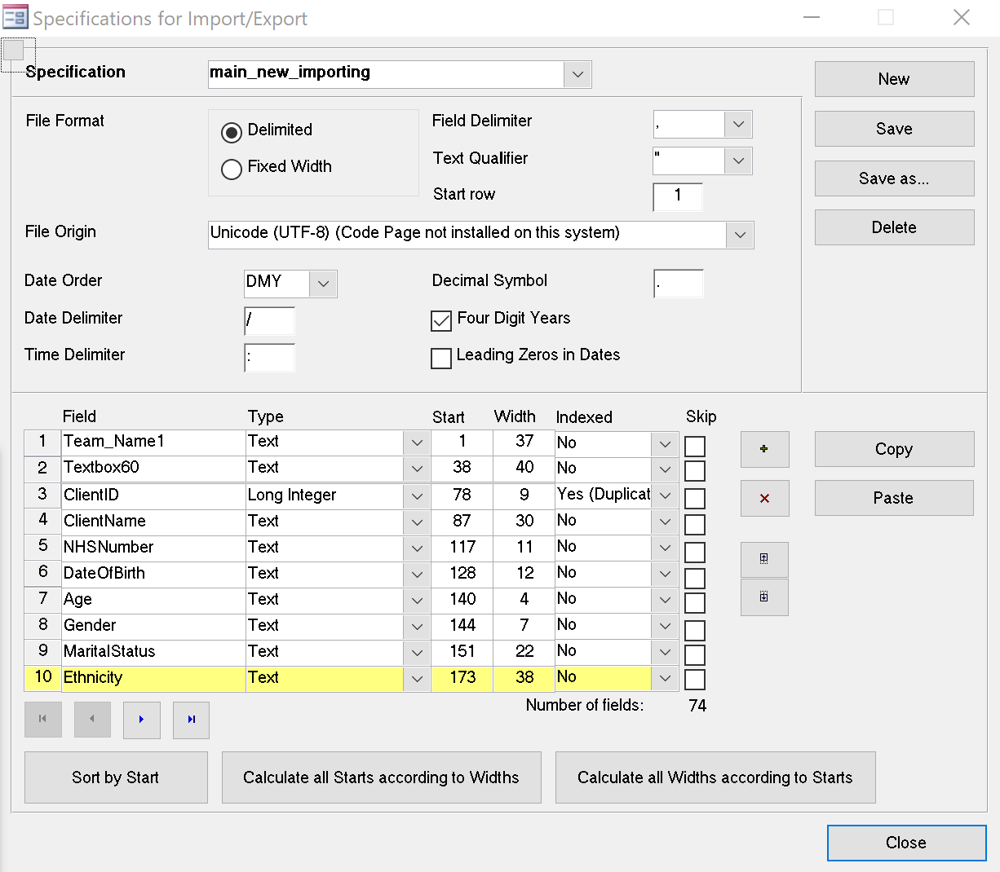

# Caseload Analysis in Access for PD

This is a project that relies on getting information from a CSV file exported via SSRS system. The information is imported, analysed and reports are produced.

## File descriptions

* `access` directory - the Access database file
* Data sub-directory `data`   
	*	sample data file for import
	*	fake sample patient information, no real data
* `forms` subdirectory - information about forms
* `sql` subdirectory - queries with notes
* `tables` subdirectory - information about tables 
* `vba` subdirectory - copy of modules in the datbase

## Workflow

* Open the database - you have to have MS-Office 2010 or later.
* Import data button lower left side. You have to select csv file that has the required fields (see import specification) - 74 fields in the caseload scv file. Strings are delimited with " quotes ", commas are delimters. The only field that imports as numbers is `ClientID`.
	* At the end of importing process you should get a message that all date are imported.
	* If `tbl_Clinican` has not been set up with checkmarks denoting your team (`isRealPD` and `isTWLPD`) - a dialogue pops up telling you to place the checkmarks. This is necessary for correct functioning of reports. Read further on it in the `readme` of the `tables` subdirectory.
* Use  	`Clinican RAG-ing` to select the clinician caseload and enter data. Although you can enter several lines (up to 255 characters), please try to keep everything short. 

