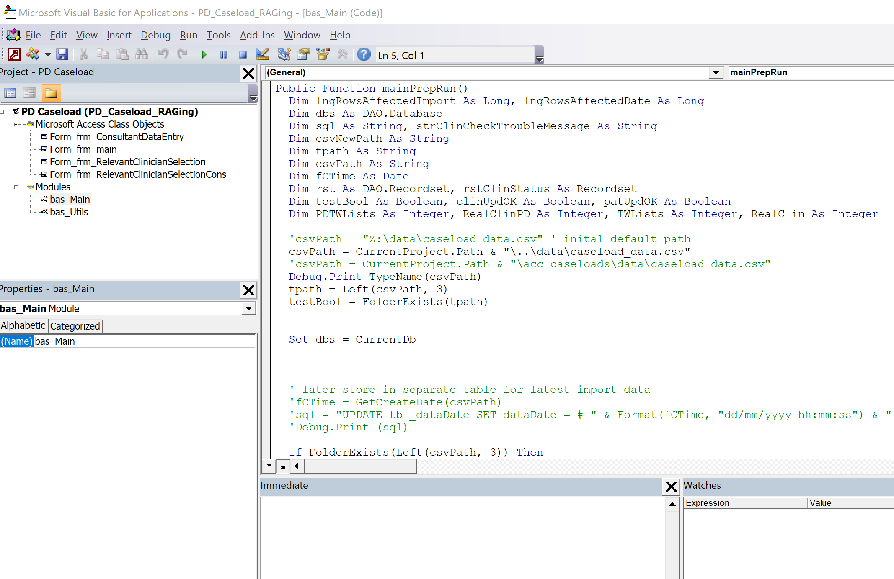

# VBA modules

These are VBA modules used in the database. `bas_Main` and `bas_Utils` are actually used in the database, but `file_functions` are just some useful functions that were used, but are at present not necessary. When module is updated the dorrect code is copied over to/from VBA editor. Forms that have some VBA code are also represented here. Code can be pasted into VBA editor, ore eidted in your favourite text editor and then pasted in VBA editor.

